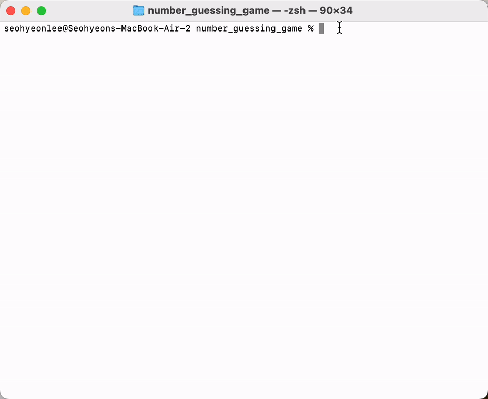

# 숫자 맞추기 게임

## 개요

이 게임은 플레이어가 1에서 1000 사이의 비밀 숫자를 맞추는 간단한 터미널 기반 게임입니다. 플레이어는 게임 진행 상황을 확인할 수 있으며, 총 몇 게임을 했는지와 가장 적은 시도로 맞춘 기록을 볼 수 있습니다. 게임 데이터는 PostgreSQL 데이터베이스에 저장되어, 사용자가 점수를 기록하고 자신의 기록을 추적할 수 있습니다.

## 기능

- **게임 플레이**: 비밀 숫자를 맞추고 시도 횟수를 확인할 수 있습니다.
- **진행 상황 추적**: 플레이한 게임 수와 최상의 점수(가장 적은 시도 횟수)를 확인할 수 있습니다.
- **데이터베이스 저장**: 사용자 데이터(사용자 이름, 플레이한 게임 수, 최상의 점수)와 게임 결과(게임당 시도 횟수)는 PostgreSQL 데이터베이스에 저장됩니다.

## 요구 사항

- **PostgreSQL**: 게임은 사용자 및 게임 데이터를 저장하기 위해 PostgreSQL 데이터베이스를 사용합니다.
- **Bash 셸**: 게임 스크립트는 Bash로 작성되었습니다.

## 설정 방법

### 1. PostgreSQL 설치

먼저 PostgreSQL이 설치되어 있는지 확인하세요. 공식 PostgreSQL 웹사이트에서 설치할 수 있습니다. [https://www.postgresql.org/download/](https://www.postgresql.org/download/)

### 2. 리포지토리 클론

```bash
git clone <repository_url>
cd <game_directory>
```

### 3. 실행 권한 부여

게임 스크립트를 실행할 수 있도록 권한을 추가합니다.

```bash
chmod +x number_guess.sh
```

### 4. 게임 시작

게임을 시작하려면 다음 명령어를 입력하세요:

```bash
./number_guess.sh
```

## 게임 방법

1. 게임 스크립트를 실행합니다.
2. 사용자 이름을 입력합니다.
3. 시스템이 1에서 1000 사이의 비밀 숫자를 생성합니다.
4. 숫자를 맞추기 위해 추측을 입력합니다. 시스템이 숫자가 더 높거나 낮다고 알려줍니다.
5. 숫자를 맞추면 게임이 시도 횟수를 보여줍니다.
6. 게임이 데이터베이스에서 진행 상황을 업데이트합니다.

### 5. 플레이 영상


## 데이터베이스 구조



- **users** 테이블:

  - `user_id`: 각 사용자의 고유 ID (primary key).
  - `username`: 사용자가 선택한 사용자 이름.
  - `games_played`: 사용자가 플레이한 게임 수.
  - `best_game`: 사용자가 플레이한 게임 중에서 가장 적은 시도로 비밀 숫자를 맞췄을 때 시도했던 횟수.

- **games** 테이블:
  - `game_id`: 각 게임의 고유 ID (primary key).
  - `user_id`: `users` 테이블의 `user_id`를 참조 (foriegn key).
  - `number_of_guesses`: 비밀 숫자를 맞출 때까지 시도한 횟수.

## 기여 방법

코드 관련해서 건의사항이 있으신 분들은 repository를 fork하신 다음 pull request를 제출해주세요.
1주일 내로 검토한 다음 답변드리겠습니다.

## 라이선스

이 게임은 오픈 소스이며 MIT 라이선스에 따라 제공됩니다.
